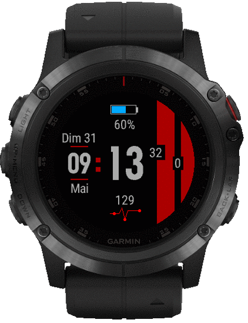

# ftw-garmin
FTW - Watch Faces for Garmin

https://developer.garmin.com/connect-iq/overview/

## TOC

* [Projet](#projet)
* [Version](#version)

## Projet

"FTW" est un cadran configurable pour montre Garmin.

Les appareils compatibles sont nombreux, voir [manifest.xml](https://github.com/joakim-ribier/ftw-garmin/blob/master/manifest.xml#L4).

### Configuration

Liste exhaustive des possibilités :

* Changer la couleur du thème (bleu, rouge, vert)
* Cacher/Afficher le jour courant
* Cacher/Afficher le mois courant
* Cacher/Afficher le pourcentage de batterie restant
* Cacher/Afficher le cardio
* Passer en mode FTW ("APERO TIME") `¯\_(ツ)_/¯`

## Version

0.1.3

* Correction d'un bug sur l'affichage des secondes

0.1.2

* Mise à jour partielle (secondes; bpm) chaque minute

0.1.1

* Mise à jour de la vue "mode FTW"
* Possibilité de configurer les horaires d'apérooo (matin / après-midi)

0.1.0

Première version du cadran.

* Changer la couleur du thème (bleu, rouge, vert)
* Cacher / Afficher le jour courant
* Cacher / Afficher le mois courant
* Cacher / Afficher le pourcentage de batterie restant
* Cacher / Afficher le cardio
* Afficher la vue "APERO TIME"
* Passer en mode FTW !

[haut](#toc)