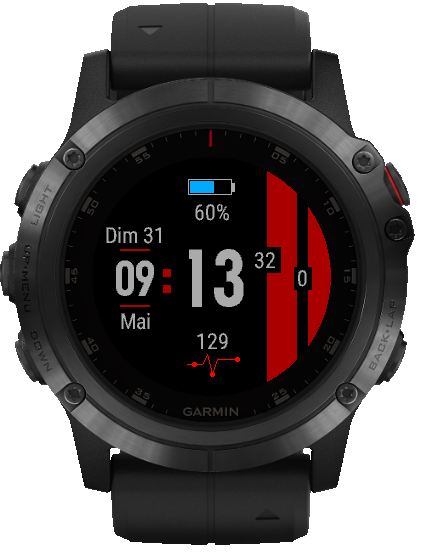

# ftw-garmin
FTW - Watch Faces for Garmin

https://developer.garmin.com/connect-iq/overview/

## TOC

* [Projet](#projet)

## Projet

"FTW" est un cadran configurable pour montre Garmin.

Les appareils compatibles sont nombreux, voir [manifest.xml](https://github.com/joakim-ribier/ftw-garmin/blob/master/manifest.xml#L4).

### Configuration

Liste exhaustive des possibilités :

* Changer la couleur du thème (bleu, rouge, vert)
* Cacher/Afficher le jour courant
* Cacher/Afficher le mois courant
* Cacher/Afficher le pourcentage de batterie restant
* Cacher/Afficher le cardio
* Afficher la vue "APERO TIME" lorsque c'est l'heure de prendre l'apéritif (pas encore configurable, 12h15 / 18h15) `¯\_(ツ)_/¯`
* Passer en mode FTW !

[haut](#toc)